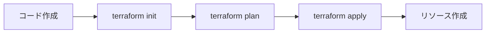

# Terraform 基礎知識

## 🛠️ Terraform とは？

**Terraform**は、HashiCorp 社が開発したオープンソースの「Infrastructure as Code (IaC)」ツールです。インフラストラクチャをコードで定義・管理することで、一貫性のある環境を自動的に構築できます。

## 💡 Infrastructure as Code (IaC) とは？

### 従来の手動作業 vs IaC

| 従来の手動作業               | Infrastructure as Code |
| ---------------------------- | ---------------------- |
| Web コンソールでポチポチ操作 | コードで定義           |
| 手順書に頼る                 | コードが手順書         |
| 人為的ミスが発生             | 自動化によりミスを削減 |
| 環境の差異が生まれやすい     | 同じコードで同じ環境   |
| 変更履歴の管理が困難         | Git でバージョン管理   |

### IaC の利点

1. **再現性**: 同じ環境を何度でも作成可能
2. **バージョン管理**: インフラの変更履歴を管理
3. **自動化**: 人手を介さない一貫した構築
4. **ドキュメント化**: コード自体が設計書
5. **スケーラビリティ**: 大規模環境でも効率的に管理

## 🔧 Terraform の仕組み

### 基本的なワークフロー



### 各コマンドの役割

#### 1. `terraform init` - 初期化

- **目的**: 作業環境の準備
- **実行内容**:
  - 必要なプロバイダー（Azure、AWS など）をダウンロード
  - 状態管理用のファイルを初期化
  - モジュールの依存関係を解決

#### 2. `terraform plan` - 実行計画

- **目的**: 何が変更されるかを事前確認
- **実行内容**:
  - 現在の状態とコードの差分を計算
  - 追加・変更・削除されるリソースを表示
  - 実際には何も変更しない「予行演習」

#### 3. `terraform apply` - 実行

- **目的**: 実際にインフラを変更
- **実行内容**:
  - plan で計算した変更を実際に適用
  - クラウドサービスの API を呼び出してリソースを操作
  - 状態ファイルを更新

#### 4. `terraform destroy` - 削除

- **目的**: 管理しているリソースをすべて削除
- **実行内容**:
  - 依存関係を考慮してリソースを削除
  - 状態ファイルをクリア

## 📋 Terraform の基本概念

### 1. プロバイダー (Provider)

- **役割**: どのクラウドサービスを使うかを定義
- **例**: `azurerm`(Azure), `aws`(AWS), `google`(GCP)
- **設定場所**: `providers.tf`

```hcl
terraform {
  required_providers {
    azurerm = {
      source  = "hashicorp/azurerm"
      version = "~> 4.0"
    }
  }
}
```

### 2. リソース (Resource)

- **役割**: 作成する実際のインフラコンポーネント
- **構文**: `resource "リソースタイプ" "名前" { 設定 }`
- **例**: ストレージアカウント、仮想マシンなど

```hcl
resource "azurerm_storage_account" "main" {
  name                     = "mystorageaccount"
  resource_group_name      = azurerm_resource_group.main.name
  location                 = azurerm_resource_group.main.location
  account_tier             = "Standard"
  account_replication_type = "LRS"
}
```

### 3. 変数 (Variables)

- **役割**: 設定値を動的に変更可能にする
- **定義場所**: `variables.tf`
- **値の設定**: `terraform.tfvars`

```hcl
# 変数定義
variable "storage_account_name" {
  description = "ストレージアカウント名"
  type        = string
  default     = "defaultname"
}

# 変数使用
resource "azurerm_storage_account" "main" {
  name = var.storage_account_name
}
```

### 4. 出力 (Outputs)

- **役割**: 作成されたリソースの情報を出力
- **用途**: 他のシステムとの連携、確認用
- **定義場所**: `outputs.tf`

```hcl
output "storage_account_name" {
  value = azurerm_storage_account.main.name
}
```

### 5. 状態管理 (State)

- **役割**: 現在のインフラの状態を記録
- **ファイル**: `terraform.tfstate`
- **重要性**:
  - Terraform が現在の状態を把握するために必要
  - チーム開発では共有ストレージに保存

## 🗃️ ファイル構成のベストプラクティス

### 基本構成

```
├── main.tf          # メインのリソース定義
├── variables.tf     # 変数定義
├── outputs.tf       # 出力定義
├── providers.tf     # プロバイダー設定
├── terraform.tfvars # 変数の値（機密情報含む）
└── README.md        # ドキュメント
```

### ファイル分割の考え方

- **main.tf**: 主要なリソース定義
- **variables.tf**: すべての変数定義をまとめる
- **outputs.tf**: すべての出力定義をまとめる
- **providers.tf**: プロバイダー関連の設定
- **terraform.tfvars**: 環境固有の値

## 🔄 依存関係の管理

### 暗黙的依存関係

Terraform は自動的にリソース間の依存関係を解析します。

```hcl
# リソースグループを先に作成
resource "azurerm_resource_group" "main" {
  name     = "rg-example"
  location = "Japan East"
}

# ストレージアカウントはリソースグループに依存
resource "azurerm_storage_account" "main" {
  resource_group_name = azurerm_resource_group.main.name  # 依存関係
  location           = azurerm_resource_group.main.location
}
```

### 明示的依存関係

必要に応じて`depends_on`で明示的に依存関係を指定できます。

```hcl
resource "azurerm_storage_blob" "main" {
  # 他のリソースに明示的に依存
  depends_on = [azurerm_storage_container.main]
}
```

## 🌍 Terraform の特徴

### マルチクラウド対応

- 単一のツールで複数のクラウドプロバイダーを管理
- AWS、Azure、GCP、Kubernetes など多数のプロバイダーをサポート

### 宣言的記述

- **宣言的**: 「最終的にこうなっていてほしい」を記述
- **命令的**: 「これをして、次にこれをして」の手順を記述
- Terraform は宣言的なため、理想状態を定義するだけ

### ドライラン機能

- `terraform plan`で実際の変更前に影響を確認
- 予期しない変更を防ぐ安全機能

## ⚠️ 注意点

### 状態ファイルの重要性

- `terraform.tfstate`は絶対に手動編集しない
- チーム開発では共有場所（Azure Blob、S3 など）に保存
- バックアップの取得を忘れずに

### リソースの削除

- Terraform で管理していないリソースは削除できない
- `terraform destroy`は管理下のすべてのリソースを削除

### バージョン管理

- プロバイダーのバージョンを固定してバージョンアップによる問題を防ぐ
- Terraform のバージョンも固定することを推奨

## 📚 学習リソース

### 公式ドキュメント

- [Terraform documentation](https://www.terraform.io/docs)
- [Azure Provider documentation](https://registry.terraform.io/providers/hashicorp/azurerm/latest/docs)

### 実践的な学習

- [Terraform tutorials](https://learn.hashicorp.com/terraform)
- [Azure Terraform examples](https://github.com/hashicorp/terraform-provider-azurerm/tree/main/examples)

これで Terraform の基本概念が理解できました。次は [ファイル構成解説](./03-file-structure.md) で、実際のコードファイルの中身を詳しく見ていきましょう。
