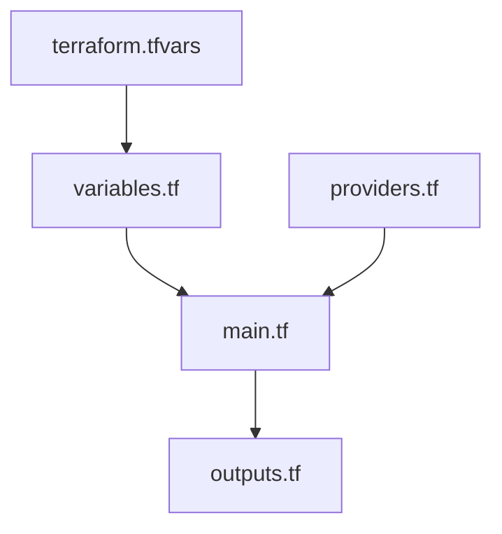

# ファイル構成解説

このプロジェクトの各ファイルの役割と内容を詳しく解説します。

## 📁 プロジェクト構成

```
├── main.tf          # メインのリソース定義
├── variables.tf     # 変数定義
├── outputs.tf       # 出力定義
├── providers.tf     # プロバイダー設定
├── terraform.tfvars # 変数の値設定
├── README.md        # プロジェクト説明
└── docs/           # ドキュメント
    ├── README.md
    ├── 01-azure-basics.md
    ├── 02-terraform-basics.md
    ├── 03-file-structure.md
    ├── 04-execution-guide.md
    └── 05-best-practices.md
```

## 📄 ファイル詳細解説

### 1. `providers.tf` - プロバイダー設定

```hcl
terraform {
  required_providers {
    azurerm = {
      source  = "hashicorp/azurerm"
      version = "~> 4.0"
    }
  }
}

provider "azurerm" {
  features {}
  subscription_id = var.subscription_id
}
```

#### 解説

- **`terraform`ブロック**: Terraform 自体の設定

  - `required_providers`: 使用するプロバイダーを指定
  - `source`: プロバイダーの配布元（HashiCorp 公式）
  - `version`: 使用するバージョン（`~> 4.0` = 4.x 系の最新）

- **`provider`ブロック**: Azure プロバイダーの設定
  - `features {}`: Azure 固有の機能設定（現在は空）
  - `subscription_id`: どの Azure サブスクリプションを使うか

#### なぜバージョンを指定するの？

- プロバイダーの自動更新による予期しない動作を防ぐ
- チーム間で同じバージョンを使用することで一貫性を保つ
- `~> 4.0`は「4.0 以上、5.0 未満」を意味する

### 2. `variables.tf` - 変数定義

```hcl
variable "subscription_id" {
  description = "Azure サブスクリプション ID"
  type        = string
}

variable "resource_group_name" {
  description = "リソースグループ名"
  type        = string
  default     = "rg-terraform-demo"
}

variable "location" {
  description = "Azure リージョン"
  type        = string
  default     = "Japan East"
}

variable "storage_account_name" {
  description = "ストレージアカウント名（グローバルで一意である必要があります）"
  type        = string
  default     = "azuretrainingyokoyamast"

  validation {
    condition     = can(regex("^[a-z0-9]{3,24}$", var.storage_account_name))
    error_message = "ストレージアカウント名は3-24文字の小文字と数字のみで構成される必要があります。"
  }
}

variable "container_name" {
  description = "Blob コンテナ名"
  type        = string
  default     = "files"
}

variable "blob_name" {
  description = "アップロードするBlob名"
  type        = string
  default     = "sample.txt"
}

variable "local_file_path" {
  description = "アップロードするローカルファイルのパス"
  type        = string
  default     = "./sample.txt"
}
```

#### 解説

##### 変数の構成要素

- **`description`**: 変数の説明（必須ではないが推奨）
- **`type`**: データ型（`string`, `number`, `bool`, `list`, `map`など）
- **`default`**: デフォルト値（設定しない場合は実行時に入力を求められる）
- **`validation`**: 入力値の検証ルール

##### 変数の種類

1. **必須変数**（`subscription_id`）

   - デフォルト値なし
   - 実行時に必ず値を指定する必要がある

2. **オプション変数**（その他）
   - デフォルト値あり
   - 必要に応じて値を変更可能

##### 検証ルール

```hcl
validation {
  condition     = can(regex("^[a-z0-9]{3,24}$", var.storage_account_name))
  error_message = "ストレージアカウント名は3-24文字の小文字と数字のみで構成される必要があります。"
}
```

- Azure のストレージアカウント名の制約をコードで強制
- 正規表現で入力値をチェック
- 条件に合わない場合はエラーメッセージを表示

### 3. `terraform.tfvars` - 変数値設定

```hcl
subscription_id = "0d9ca316-2899-4a10-b81f-3c2cc3ed31f6"
resource_group_name = "rg-storage-demo"
location = "Japan East"
storage_account_name = "azuretrainingyokoyamast"
container_name = "files"
blob_name = "uploaded-file.txt"
local_file_path = "./sample.txt"
```

#### 解説

- 変数の実際の値を設定するファイル
- 環境ごとに異なるファイルを作成可能（`dev.tfvars`, `prod.tfvars`など）
- **重要**: このファイルには機密情報が含まれるため、Git 管理から除外すべき

#### セキュリティ注意点 ⚠️

```gitignore
# .gitignore に追加
*.tfvars
terraform.tfstate*
.terraform/
```

### 4. `main.tf` - メインリソース定義

```hcl
# リソースグループの作成
resource "azurerm_resource_group" "main" {
  name     = var.resource_group_name
  location = var.location

  tags = {
    Environment = "Learning"
    Project     = "Terraform-Demo"
  }
}

# ストレージアカウントの作成
resource "azurerm_storage_account" "main" {
  name                     = var.storage_account_name
  resource_group_name      = azurerm_resource_group.main.name
  location                 = azurerm_resource_group.main.location
  account_tier             = "Standard"
  account_replication_type = "LRS"

  tags = {
    Environment = "Learning"
    Project     = "Terraform-Demo"
  }
}

# Blobコンテナの作成
resource "azurerm_storage_container" "main" {
  name                  = var.container_name
  storage_account_name  = azurerm_storage_account.main.name
  container_access_type = "private"
}

# ローカルファイルのBlobアップロード
resource "azurerm_storage_blob" "main" {
  name                   = var.blob_name
  storage_account_name   = azurerm_storage_account.main.name
  storage_container_name = azurerm_storage_container.main.name
  type                   = "Block"
  source                 = var.local_file_path
}
```

#### 解説

##### 1. リソースグループ

```hcl
resource "azurerm_resource_group" "main" {
  name     = var.resource_group_name
  location = var.location

  tags = {
    Environment = "Learning"
    Project     = "Terraform-Demo"
  }
}
```

- **役割**: 関連するリソースをまとめる論理的なコンテナ
- **`name`**: リソースグループ名（Azure 内で一意）
- **`location`**: データセンターの場所
- **`tags`**: メタデータ（課金管理、検索用）

##### 2. ストレージアカウント

```hcl
resource "azurerm_storage_account" "main" {
  name                     = var.storage_account_name
  resource_group_name      = azurerm_resource_group.main.name
  location                 = azurerm_resource_group.main.location
  account_tier             = "Standard"
  account_replication_type = "LRS"
}
```

- **`account_tier`**:
  - `Standard`: 一般的な用途、コスト効率
  - `Premium`: 高性能、SSD 使用
- **`account_replication_type`**:
  - `LRS`: 同一データセンター内で 3 重化
  - `GRS`: 地理的に離れた場所に複製
  - `ZRS`: 同一リージョンの複数ゾーンで複製

##### 3. Blob コンテナ

```hcl
resource "azurerm_storage_container" "main" {
  name                  = var.container_name
  storage_account_name  = azurerm_storage_account.main.name
  container_access_type = "private"
}
```

- **役割**: ファイルを整理するための「フォルダ」
- **`container_access_type`**:
  - `private`: 認証が必要（推奨）
  - `blob`: Blob 単位で匿名アクセス可能
  - `container`: すべての Blob に匿名アクセス可能

##### 4. Blob ファイル

```hcl
resource "azurerm_storage_blob" "main" {
  name                   = var.blob_name
  storage_account_name   = azurerm_storage_account.main.name
  storage_container_name = azurerm_storage_container.main.name
  type                   = "Block"
  source                 = var.local_file_path
}
```

- **`type`**:
  - `Block`: 一般的なファイル用
  - `Page`: 仮想マシンのディスク用
  - `Append`: ログファイル用
- **`source`**: アップロードするローカルファイルのパス

##### 依存関係の自動解決

Terraform は以下の順序で自動的にリソースを作成します：

1. リソースグループ
2. ストレージアカウント
3. Blob コンテナ
4. Blob ファイル

### 5. `outputs.tf` - 出力定義

```hcl
output "resource_group_name" {
  description = "作成されたリソースグループ名"
  value       = azurerm_resource_group.main.name
}

output "storage_account_name" {
  description = "作成されたストレージアカウント名"
  value       = azurerm_storage_account.main.name
}

output "storage_account_primary_key" {
  description = "ストレージアカウントの主キー"
  value       = azurerm_storage_account.main.primary_access_key
  sensitive   = true
}

output "blob_url" {
  description = "アップロードされたBlobのURL"
  value       = azurerm_storage_blob.main.url
}

output "storage_account_primary_connection_string" {
  description = "ストレージアカウントの接続文字列"
  value       = azurerm_storage_account.main.primary_connection_string
  sensitive   = true
}
```

#### 解説

- **用途**: 作成されたリソースの情報を外部に提供
- **`sensitive = true`**: 機密情報として扱い、ログに出力しない
- **活用例**:
  - 他のシステムへの連携情報
  - アプリケーションの設定値
  - 確認・デバッグ用情報

#### 出力値の確認方法

```powershell
terraform output                    # すべての出力を表示
terraform output storage_account_name  # 特定の出力のみ表示
terraform output -json              # JSON形式で出力
```

## 🔗 ファイル間の関係

### データの流れ



1. `terraform.tfvars`で値を設定
2. `variables.tf`で変数を定義
3. `main.tf`で変数を使用してリソース作成
4. `outputs.tf`で作成結果を出力
5. `providers.tf`でクラウドプロバイダーを設定

### 参照の方法

- **変数参照**: `var.変数名`
- **リソース参照**: `リソースタイプ.リソース名.属性`
- **例**: `azurerm_resource_group.main.name`

## 🎯 設計のポイント

### 1. 再利用性

- 変数を使うことで異なる環境に対応
- デフォルト値で基本的な設定を提供

### 2. 保守性

- ファイルを役割別に分割
- コメントと説明で可読性向上

### 3. セキュリティ

- 機密情報は`terraform.tfvars`に分離
- `sensitive = true`で出力制御

### 4. 検証

- 変数に validation ルールを設定
- Azure の制約をコードで強制

次は [実行手順](./04-execution-guide.md) で、実際にこれらのファイルを使ってインフラを構築する方法を学びましょう。
