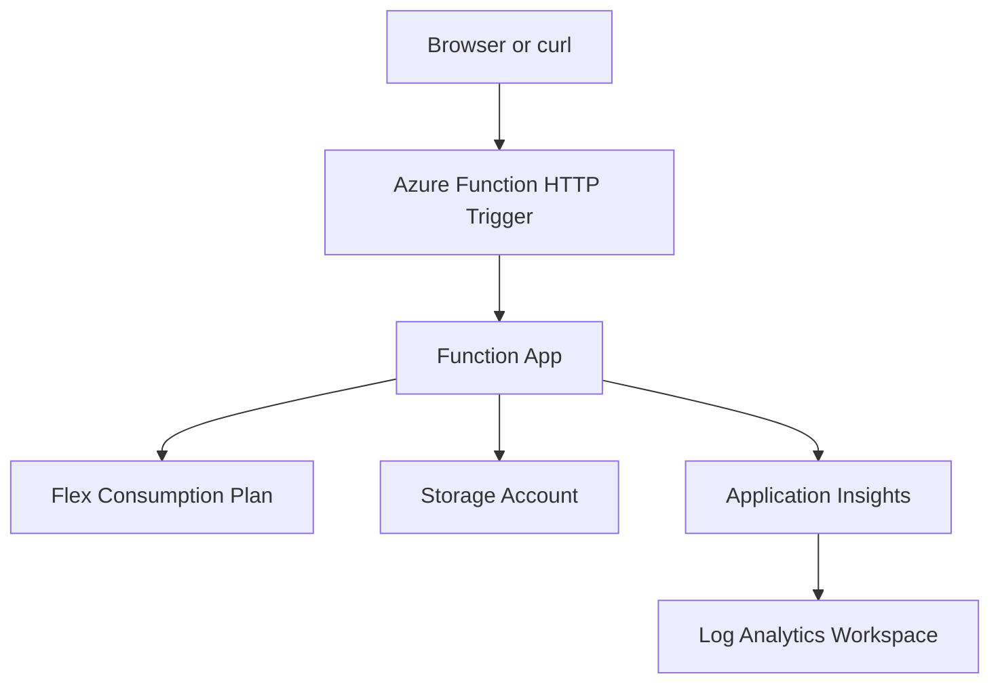

# Azure Functions 最小構成 Plan

## 概要

Terraform で Azure Functions の最小構成を作り、HTTP URL にアクセスすると `Hello World` を返すところまでを目標にする。

この plan では、**インフラは Terraform の module で分割**し、**関数コードは Python モジュールで分割**する前提を採用する。

役割分担は次のとおり。

- Terraform の root module が Azure リソース作成をオーケストレーションする
- Resource Group、Storage、Monitoring、Function App は個別 module に切り出す
- Azure Functions 側の薄いエントリーポイントから `main.py` を呼び出し、`main.py` がアプリケーションの処理をオーケストレーションする

こうしておくと、インフラの責務とアプリケーションの責務を分けたまま、それぞれを小さく理解できる。

## 目標

- Resource Group を作成できる
- Azure Functions 用の最小ストレージを作成できる
- Linux ベースの Function App を作成できる
- 匿名アクセス可能な HTTP Trigger で `Hello World` を返せる
- `curl` またはブラウザで疎通確認できる

## 採用方針

### ホスティングプラン

今回は **Flex Consumption** を第一候補にする。

- Microsoft Learn の quickstart が Terraform での最新導線として Flex Consumption を案内している
- Microsoft Learn では、新しい serverless Function App には Flex Consumption を使うことを推奨している
- Linux Consumption は将来的な退役案内があり、新規学習対象としては優先度が低い

### コード配置方針

今回は **インフラ作成とアプリケーション実装を分けつつ、両方ともモジュール化する**。

- Terraform: Resource Group / Storage / Monitoring / Service Plan / Function App を module 化して作る
- Python アプリ: function ごとのエントリーポイントは薄く保ち、`main.py` に処理を集約する
- デプロイ: Azure CLI もしくは Azure Functions Core Tools で関数コードを配置する

この分け方にすると、最初の学習で「Azure リソースの役割」「関数の入口」「実際のビジネスロジック」を混同しにくい。

### モジュール化方針

Terraform 側:

- `modules/resource_group`: Resource Group 作成
- `modules/storage_account`: Function App 用 Storage Account 作成
- `modules/monitoring`: Log Analytics Workspace と Application Insights 作成
- `modules/function_app`: Service Plan と Function App 作成

Python 側:

- `main.py`: リクエスト処理全体のオーケストレーション
- `handlers/hello.py`: Hello World 応答の組み立て
- `services/response_builder.py`: HTTP レスポンス生成の共通処理

補足:

- Azure Functions Python ランタイムの都合で、実際の公開エントリーポイントは `function_app.py` または function ディレクトリ配下の薄いファイルになる
- そのファイルでは処理を書き込まず、`main.py` を呼び出すだけにする

## 最小構成アーキテクチャ



## 作成対象リソース

### 必須

1. `azurerm_resource_group`
2. `azurerm_storage_account`
3. `azurerm_service_plan`
4. `azurerm_function_app_flex_consumption`
5. `azurerm_log_analytics_workspace`
6. `azurerm_application_insights`

### 必須ではないが今回ほしいもの

1. `output` で Function App 名と URL を出す
2. 関数コード配置用の最小ディレクトリ
3. デプロイ用 zip または Core Tools publish 手順

## ディレクトリ案

```text
Functions/
├── infra/
│   ├── main.tf
│   ├── variables.tf
│   ├── outputs.tf
│   ├── providers.tf
│   └── modules/
│       ├── resource_group/
│       │   ├── main.tf
│       │   ├── variables.tf
│       │   └── outputs.tf
│       ├── storage_account/
│       │   ├── main.tf
│       │   ├── variables.tf
│       │   └── outputs.tf
│       ├── monitoring/
│       │   ├── main.tf
│       │   ├── variables.tf
│       │   └── outputs.tf
│       └── function_app/
│           ├── main.tf
│           ├── variables.tf
│           └── outputs.tf
└── app/
    ├── host.json
    ├── requirements.txt
    ├── function_app.py
    └── src/
        ├── main.py
        ├── handlers/
        │   └── hello.py
        └── services/
            └── response_builder.py
```

補足:

- 既存の [resources/blob/infra-terraform/main.tf](../resources/blob/infra-terraform/main.tf) とは分けて、Functions 用に独立したディレクトリを切る
- Functions 用の構成は `resources/functions/` 配下に切る
- アプリ側は Python を採用し、Azure Functions の入口ファイルは薄く、実処理は `src/main.py` 以下へ寄せる

## 実装ステップ

### Step 1. Terraform の土台を作る

- `required_providers` に `azurerm` を定義する
- `provider "azurerm"` を定義する
- root module の `main.tf` から子 module を呼び出す形にする
- `location`、`project_name` など最小変数を決める

この段階の完了条件:

- `terraform init` が通る
- `terraform validate` が通る

### Step 2. Resource Group と Storage Account を作る

- `modules/resource_group` で Function App 用 Resource Group を作る
- `modules/storage_account` で Function App の実行やデプロイに必要な Storage Account を作る
- root module から module 出力を受けて次の module に渡す
- 命名制約を踏まえて Storage Account 名を短く保つ

この段階の完了条件:

- `terraform plan` で Resource Group と Storage Account の差分が確認できる

### Step 3. 監視系リソースを作る

- `modules/monitoring` で Log Analytics Workspace を作る
- `modules/monitoring` で Application Insights を作る
- Function App module に監視関連の接続情報を渡せる形にする

この段階の完了条件:

- `terraform plan` に監視系リソースが含まれる

### Step 4. Flex Consumption Plan と Function App を作る

- `modules/function_app` で Linux の Flex Consumption Plan を定義する
- `modules/function_app` で `azurerm_function_app_flex_consumption` を作る
- ランタイムは Python 系を選ぶ
- HTTPS only と最小限の app settings を設定する

この段階の完了条件:

- `terraform apply` 後に Function App が Azure 上に存在する
- `output` で Function App 名とホスト名を取得できる

### Step 5. Hello World 関数コードを用意する

- Azure Functions の HTTP Trigger を 1 つだけ作る
- Azure Functions のエントリーポイントは薄く保ち、`src/main.py` を呼ぶだけにする
- `src/main.py` では入力受付、ハンドラー呼び出し、レスポンス整形をオーケストレーションする
- `handlers/hello.py` で Hello World の本文を返す
- 認証レベルは `anonymous` にする
- レスポンス本文は `Hello World` に固定する

想定 URL 例:

- `https://<function-app-host>/api/hello`

この段階の完了条件:

- ローカルの関数プロジェクトが作成できる
- `main.py` から handler を呼ぶ流れがローカルで確認できる
- zip 化または publish 可能な状態になる

### Step 6. 関数コードをデプロイする

候補は以下のどちらか。

1. Azure Functions Core Tools の `func azure functionapp publish`
2. Azure CLI の zip deploy

初回は Core Tools のほうが理解しやすいが、依存を減らすなら Azure CLI zip deploy でもよい。

この段階の完了条件:

- 関数一覧に `hello` が見える
- HTTP Trigger の URL が取得できる

### Step 7. 動作確認する

- `curl` で URL をたたく
- ステータスコード `200` を確認する
- レスポンス本文が `Hello World` であることを確認する

この段階の完了条件:

- ブラウザまたは `curl` で Hello World が返る

## 受け入れ条件

- Terraform 管理下で Azure Functions の実行基盤が module 構成で作られている
- root module が各 Terraform module を束ねている
- Azure Functions 側の薄い入口から `main.py` が呼ばれる構成になっている
- URL にアクセスすると `Hello World` が返る
- Terraform 側に Function App 名と URL の `output` がある
- `terraform destroy` で後片付けできる

## 今回やらないこと

- VNet 統合
- Private Endpoint
- カスタムドメイン
- CI/CD パイプライン
- 複数関数の同居
- Terraform module の再利用性最適化
- Python 側の複雑なレイヤード設計

## 注意点

### 1. Terraform だけで関数コード配置まで完結させない

Terraform はインフラ定義には強いが、関数コードの更新まで主役にすると学習対象がぶれやすい。最初は infra と code deploy を分ける。

### 1.5. main.py はアプリ側だけのオーケストレーションに使う

Resource Group や Function App などの Azure リソース作成は Terraform module で行う。`main.py` は Azure リソースを作る場所ではなく、関数リクエスト処理を束ねる場所として使う。

### 2. Linux Consumption ではなく Flex Consumption を優先する

新規の serverless Function App は Flex Consumption が推奨寄り。学習の出発点としてもこちらのほうが今後の差分が少ない。

### 3. URL が返らない原因はコード未配置のことが多い

Terraform apply が成功しても、関数コードを publish していなければ `/api/...` は期待どおりに返らない。Function App 作成完了と Hello World 応答は別の確認項目として扱う。

## 次に作るファイル候補

1. `resources/functions/infra-terraform/main.tf`
2. `resources/functions/infra-terraform/modules/resource_group/main.tf`
3. `resources/functions/infra-terraform/modules/storage_account/main.tf`
4. `resources/functions/infra-terraform/modules/monitoring/main.tf`
5. `resources/functions/infra-terraform/modules/function_app/main.tf`
6. `resources/functions/app/function_app.py`
7. `resources/functions/app/src/main.py`
8. `resources/functions/app/src/handlers/hello.py`

## 参考

- Microsoft Learn: Quickstart: Create and deploy Azure Functions resources from Terraform
  - https://learn.microsoft.com/en-us/azure/azure-functions/functions-create-first-function-terraform
- Microsoft Learn: Automate function app resource deployment to Azure
  - https://learn.microsoft.com/en-us/azure/azure-functions/functions-infrastructure-as-code
- Microsoft Learn: Zip push deployment for Azure Functions
  - https://learn.microsoft.com/en-us/azure/azure-functions/deployment-zip-push
- Terraform Registry: azurerm_linux_function_app
  - https://registry.terraform.io/providers/hashicorp/azurerm/latest/docs/resources/linux_function_app
- Terraform Registry: azurerm_function_app
  - https://registry.terraform.io/providers/hashicorp/azurerm/latest/docs/resources/function_app

---

作成日: 2026-05-23
調査方法: Tavily search+extract を使用
