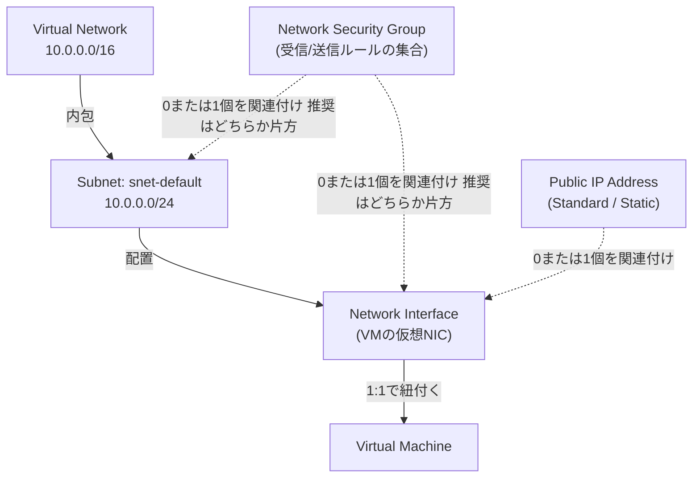
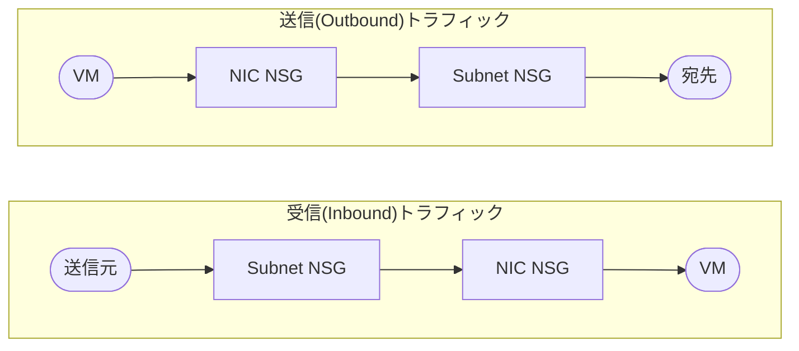
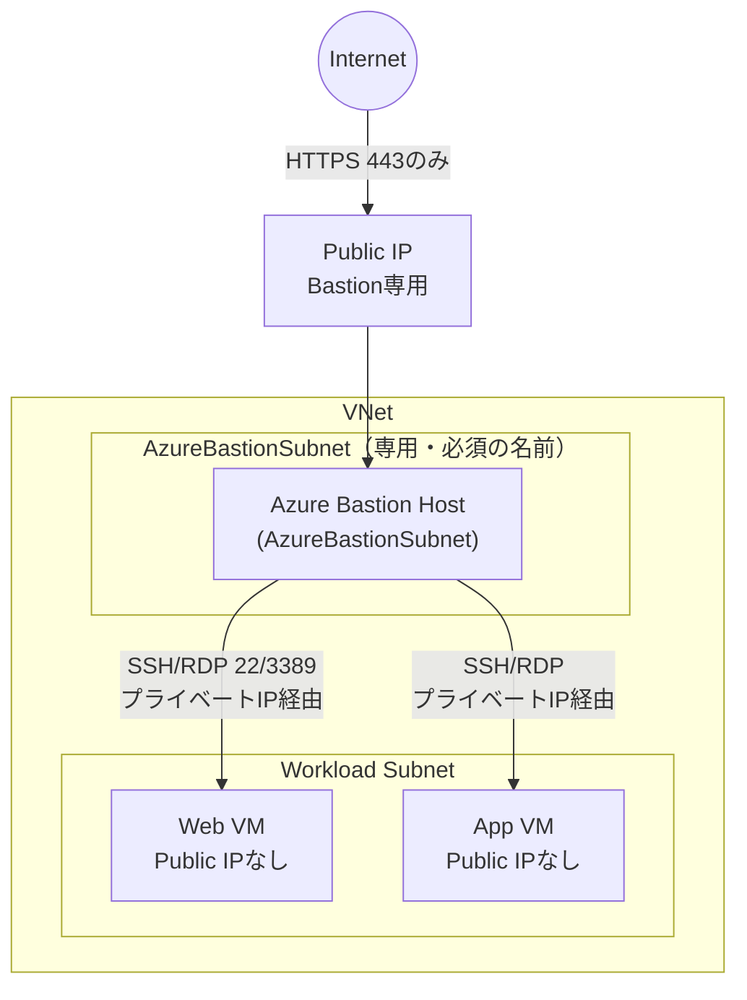
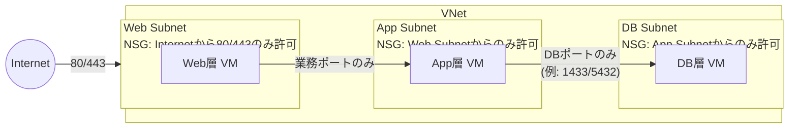

# NSG / VNet / Subnet / Public IP / NIC の関係性

`network.bicep` で作っている5リソースが、それぞれ何の役割を持ち、どう繋がっているかを整理する。
Web検索（Microsoft Learn）で調べた一次情報をもとにした深掘りメモ。

- 対象Bicep: [`modules/network.bicep`](../../infra-bicep/modules/network.bicep)
- 個別のポータル↔Bicep対応は [`gui-bicep-mapping.md`](../gui-bicep-mapping.md) を参照
- ポータルでの確認方法一覧は本メモの一つ前のやり取り（`memo-20260718.md`）を参照

## 1. 全体像：誰が誰を内包・参照しているか



**読み方のポイント**

- 「内包」と「関連付け（association）」は別物。VNet→Subnetは**所有関係**（Subnetを消すとVNetの一部が消える）。NSGやPublic IPは**独立したリソースを後から紐付けているだけ**（NSGを消してもSubnetは残る）。
- VMは直接Public IPを持てない。**必ずNICを介して**Public IPと繋がる（`network.bicep`の[NIC定義](../../infra-bicep/modules/network.bicep#L114-L116)で`publicIPAddress: { id: publicIp.id }`としているのはこのため）。
- NSGは**Subnetにも NIC にも関連付けられる**独立リソース。同時に両方へ付けることも技術的には可能だが、Microsoft自身が非推奨としている（詳細は後述）。

参考: [Quickstart: Create an Azure Virtual Network](https://learn.microsoft.com/en-us/azure/virtual-network/quickstart-create-virtual-network) / [Associate a public IP address to a VM](https://learn.microsoft.com/en-us/azure/virtual-network/ip-services/associate-public-ip-address-vm)

## 2. NSGはどこに付けるべきか：Subnet vs NIC

NSGは「Subnetに付ける」か「NICに付ける」かの選択肢があり、**両方に付けると評価順序が絡んで事故りやすい**。

### 評価順序（Subnet NSGとNIC NSGを両方使った場合）



- **受信**：Subnet NSG → NIC NSGの順で評価（どちらかでDenyされたら終わり）
- **送信**：NIC NSG → Subnet NSGの順で評価

### なぜ受信と送信で順番が違うのか

「逆順」に見えるが、実際は一貫したルールに従っている。SubnetとNICを**VMを中心とした同心円状の2つの境界**として考えるとわかりやすい。

```
外側(インターネット/他のSubnet) ── [Subnet NSGという境界] ── [NIC NSGという境界] ── VM(中心)
```

- Subnet NSG＝VMから見て**外側**の境界（Subnetの入り口）
- NIC NSG＝VMの**すぐ隣**の境界（VMの入り口）

パケットは常に「今どちらに向かって進んでいるか」の順で境界を通過する。

- **受信**：外側→中心へ進む。先にSubnet境界、次にNIC境界を通ってVMに届く（Subnet→NIC）
- **送信**：中心→外側へ進む。先にNIC境界、次にSubnet境界を抜けて外に出る（NIC→Subnet）

つまり評価ロジック自体は受信・送信で変わらず、「パケットが先に通過する境界から評価する」という同じ原則を、進行方向が逆の2つのケースに適用しているだけ。

参考: [How network security groups filter network traffic](https://learn.microsoft.com/en-us/azure/virtual-network/network-security-group-how-it-works) の VM1 の例（受信はSubnet1のNSGが先、送信はNIC1のNSGが先と明記されている）

> Tip（Microsoft Learn原文の要約）：最適なセキュリティ構成のため、NSGをSubnetとNICの両方に同時に関連付けることは避ける。どちらか片方だけにする。両方に適用するとルールが衝突し、トラブルシューティングが難しい予期しない通信問題につながる。

参考: [How network security groups filter network traffic](https://learn.microsoft.com/en-us/azure/virtual-network/network-security-group-how-it-works)

### NSGが「無い」場合はどうなるか

NSGを一切関連付けていないSubnet/NICの組み合わせは、**全ポート・全方向が許可**される（何もフィルタされない）。Public IPが付いたVMでNSGを何も付け忘れると、インターネットから全ポート到達可能になるので要注意。

参考: [Microsoft Q&A: Determine network security group effective rules](https://learn.microsoft.com/en-us/answers/questions/1662617/incorrect-information-topic-determine-network-secu)

### 今回のプロジェクトの選択

[network.bicep:79-81](../../infra-bicep/modules/network.bicep#L79-L81) で **Subnetにのみ**NSGを関連付けている（NIC側には付けていない）。これはMicrosoft推奨の「片方だけ」パターンに沿っている。Subnet単位で管理すると、将来同じSubnetにVMを増やしても同じルールが自動で効くという利点もある。

## 3. Public IPとNICの関係

- Public IPは**NICのIP構成（ipConfiguration）単位**で紐付く。1つのNICに複数のIP構成があれば、その数だけPublic IPを持たせることも可能（今回は`ipconfig1`が1つだけ）。
- NSGはPublic IPそのものには付けられない。**Public IP宛の通信も、結局はSubnet/NIC NSGでフィルタされる**（[Associate a public IP address to a VM](https://learn.microsoft.com/en-us/azure/virtual-network/ip-services/associate-public-ip-address-vm)より：「NSGはNICのプライベートIPに対してトラフィックをフィルタするが、インバウンドのインターネットトラフィックがPublic IPに届いた後、AzureがプライベートIPへ変換するため、結果的にNSGがPublic IP宛の通信もブロックしうる」）。

## 4. ユースケース1：踏み台（Bastion）構成

「SSHを特定IPからのみ許可」という今のプロジェクトの構成は最小限の踏み台パターンだが、実務ではAzure Bastionを使い**VM自体にPublic IPを持たせない**構成がより一般的。



**ポイント**

- `AzureBastionSubnet`という**固定名のSubnet**が必須（Bastion専用、他のリソースを混在させない）。
- Bastionホストだけが443番でインターネットに公開され、配下のVMはPublic IPを持たない（既存のPublic IPを外すことも推奨されている）。
- Workload Subnet側のNSGは「AzureBastionSubnetのアドレス範囲からのみ22/3389を許可」に絞るのがベストプラクティス（送信元をインターネット全体にしない）。

参考: [Configure NSG rules for Azure Bastion](https://learn.microsoft.com/en-us/azure/bastion/bastion-nsg) / [Azure Virtual Machines baseline architecture](https://learn.microsoft.com/en-us/azure/architecture/virtual-machines/baseline)

### 今の構成との違い

今のプロジェクト（[network.bicep](../../infra-bicep/modules/network.bicep)）はVM自身にPublic IPを直付けし、NSGで送信元IPを絞ることで擬似的に「自分専用の踏み台」を作っている。学習用の最小構成としては妥当だが、実務でVMを増やす場合は「Public IPを持つのはBastionだけ」に寄せていくのがセキュリティ的に一段上。

## 5. ユースケース2：Web / App / DB の3層構成

複数VMがいる場合、**Tierごとに別Subnetを切り、NSGで「隣のTierからしか入れない」ように制限する**のが定番パターン。



**ポイント**

- Web層はインターネットから直接叩かれるので、Public IP（または前段にApplication Gatewayなどのロードバランサ）を持つ。
- App層・DB層にはPublic IPを持たせない。**「DB層はWeb層と直接通信させない」がこのパターンの肝**（Web→DBの直接アクセスをNSGで明示的に拒否、またはそもそも許可ルールを作らない）。
- 各層のNSGは「1つ前の層のSubnetアドレス範囲」からのみ許可するルールを持つ。

参考: [N-tier architecture style](https://learn.microsoft.com/en-us/azure/architecture/guide/architecture-styles/n-tier) / [Windows N-tier application on Azure Stack Hub with SQL Server](https://learn.microsoft.com/en-us/azure-stack/user/iaas-architecture-windows-sql-n-tier)

## 6. まとめ：パターン比較

| 観点 | 今のプロジェクト（1VM直結） | 踏み台(Bastion)パターン | 3層(Web/App/DB)パターン |
|---|---|---|---|
| Public IPを持つのは誰 | VM自身 | Bastionホストのみ | Web層のみ（または前段のLB） |
| NSGの単位 | Subnet 1つ | Bastion Subnet + Workload Subnet | 層ごとにSubnet + NSG |
| Subnet数 | 1 | 最低2（Bastion用/Workload用） | 3以上（層の数だけ） |
| 主な用途 | 学習・検証用の最小構成 | 実務での安全な管理アクセス | 実務での多層Webアプリ |

## 参考文献（Microsoft Learn）

- [How network security groups filter network traffic](https://learn.microsoft.com/en-us/azure/virtual-network/network-security-group-how-it-works)
- [Quickstart: Create an Azure Virtual Network](https://learn.microsoft.com/en-us/azure/virtual-network/quickstart-create-virtual-network)
- [Associate a public IP address to a virtual machine](https://learn.microsoft.com/en-us/azure/virtual-network/ip-services/associate-public-ip-address-vm)
- [Azure Application Security Groups Overview](https://learn.microsoft.com/en-us/azure/virtual-network/application-security-groups)
- [Configure NSG rules for Azure Bastion](https://learn.microsoft.com/en-us/azure/bastion/bastion-nsg)
- [Azure Virtual Machines baseline architecture](https://learn.microsoft.com/en-us/azure/architecture/virtual-machines/baseline)
- [Design a secure hub-spoke network for regional web applications](https://learn.microsoft.com/en-us/azure/networking/cross-service-scenarios/design-secure-hub-spoke-network)
- [N-tier architecture style](https://learn.microsoft.com/en-us/azure/architecture/guide/architecture-styles/n-tier)
