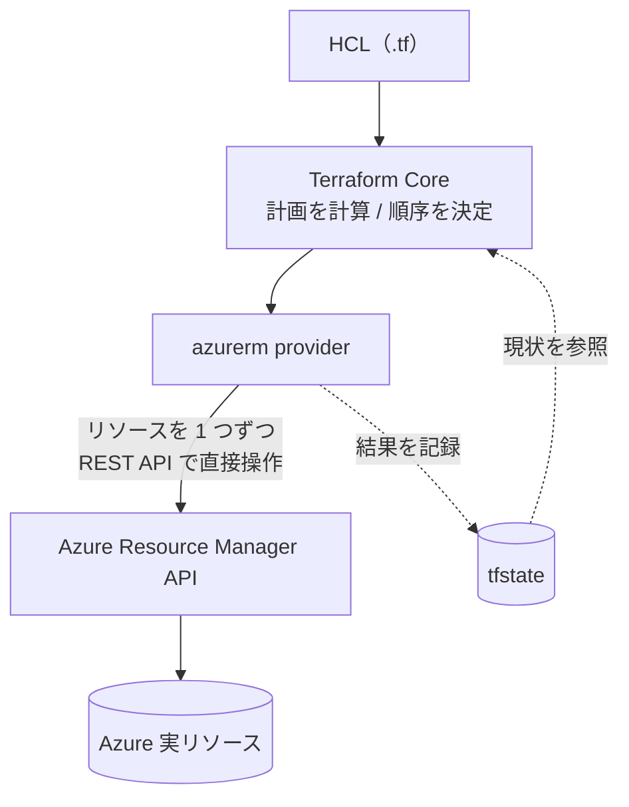
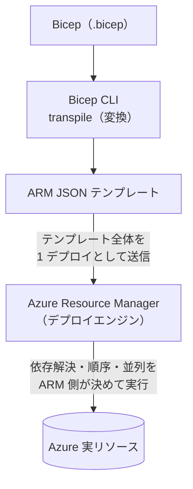

## はじめに ― Terraform は知っている。Bicep は何が違う？

「Azure を触ることになったら Bicep を勧められた。でも Terraform と何が違うのか」「state ファイルを持たないと聞いたが、それで差分や冪等性はどう担保されるのか」。

この記事は、**Terraform（HCL）で IaC を書いたことがある人**が、その語彙のまま Bicep を理解できるようにするためのものです。Bicep 文法を網羅するのではなく、`state` / `plan` / `module` / `registry` といった Terraform の概念を Bicep に**読み替えて**いきます。

先に結論を一言で言うと、Bicep と Terraform は **「宣言的（declarative）で goal-seeking」** という骨格を共有しています。だから Terraform 経験はほぼそのまま活きます。一方で、

- Bicep は **state ファイルを持たない**
- Bicep は最終的に **ARM テンプレート（JSON）に変換される**

この 2 点が決定的に違います。ここを押さえれば、残りは芋づる式に理解できます。

---

## Bicep の正体 ― ARM テンプレートへの「透過的な抽象化」

Bicep は **Azure リソースをデプロイするための宣言的 DSL（ドメイン固有言語）** です。重要なのは、Bicep が独立したデプロイエンジンを持っているわけではない、という点です。

> Bicep is a transparent abstraction over a Resource Manager JSON template that doesn't lose the capabilities of a JSON template. During deployment, the Bicep CLI converts a Bicep file into a Resource Manager JSON template.
>
> （和訳）Bicep は、JSON テンプレートの機能を一切損なわない、Resource Manager JSON テンプレートに対する透過的な抽象化です。デプロイ時に Bicep CLI が Bicep ファイルを Resource Manager JSON テンプレートへ変換します。
> （[What is Bicep? | Microsoft Learn](https://learn.microsoft.com/en-us/azure/azure-resource-manager/bicep/overview)）

つまり Bicep は **ARM テンプレート（JSON）の上に乗った「透過的な抽象化」** です。`bicep build` 相当の変換（transpile）で ARM JSON になり、それを Azure Resource Manager (ARM) が解釈してデプロイします。JSON テンプレートでできることは Bicep でも失われません。

ここが Terraform とのアーキテクチャ上の最大の差です。

### 「API への到達経路が違う」とはどういうことか

まず誤解しやすい点を先に潰しておきます。**Azure においては、Terraform も Bicep も、最終的には同じ Azure Resource Manager (ARM) の REST API に到達します。** Azure のリソース操作の入口は ARM API しかないからです。

では何が違うのか。**「誰が、どうやってデプロイを取り仕切る（オーケストレーションする）か」**が違います。

**Terraform の場合** ― オーケストレーションは**手元（クライアント側）**で行われます。Terraform 本体（Terraform Core）が state を見ながら「何をどの順で作るか」の計画を立て、`azurerm` などの provider が**リソース単位で ARM の REST API を直接呼び出し**ます。順序制御も結果の記録（state 更新）も Terraform 自身の仕事です。Terraform は「自前のデプロイエンジン」を持っている、と言い換えられます。



**Bicep の場合** ― オーケストレーションは**Azure 側（サーバー側）**に丸投げされます。Bicep CLI は Bicep ファイルを ARM JSON テンプレートに変換するだけ。あなたが ARM に渡すのは「最終的にこうなっていてほしい」という**宣言テンプレート 1 枚**です。それを受け取った ARM のデプロイエンジンが、依存関係を解決し、順序や並列実行を決めて、各リソースプロバイダを呼び出します。Bicep 自身は「デプロイエンジン」を持たず、ARM のそれを使います。



要するに差は **「オーケストレーションの場所」** です。

| | Terraform | Bicep |
|---|---|---|
| 言語 | HCL | Bicep DSL（→ ARM JSON に変換） |
| 渡し方 | provider がリソース単位で API を**直接**呼ぶ | テンプレート 1 枚を ARM に**渡すだけ** |
| オーケストレーション | **Terraform 本体（クライアント側）** | **ARM のデプロイエンジン（サーバー側）** |
| 順序・並列の決定 | Terraform の依存グラフ | ARM が自動で決定 |
| 最終的な到達先 | Azure RM REST API | Azure RM REST API（同じ） |

「ARM 経由」と言うとき重要なのは、エンドポイントの話ではなく、**実行の主導権が ARM 側にある**という点です。だからこそ次の day-0 サポートのような性質が生まれます。

ARM 経由であることの直接の恩恵が **day-0 サポート** です。

> Support for all resource types and API versions: Bicep immediately supports all preview and GA versions for Azure services. As soon as a resource provider introduces new resource types and API versions, you can use them in your Bicep file. You don't need to wait for tools to be updated before using new services.
>
> （和訳）すべてのリソースタイプと API バージョンに対応: Bicep は Azure サービスのプレビュー版・GA 版すべてを即座にサポートします。リソースプロバイダが新しいリソースタイプや API バージョンを導入した瞬間に、それを Bicep ファイルで使えます。新サービスを使うのにツールの更新を待つ必要はありません。
> （[What is Bicep? | Microsoft Learn](https://learn.microsoft.com/en-us/azure/azure-resource-manager/bicep/overview)）

Terraform では新しい Azure 機能を使うのに provider（`azurerm` 等）の対応を待つことがありますが、Bicep は ARM が新しいリソースタイプ・API バージョンを公開した瞬間に（プレビュー含めて）使えます。Azure 専従なら、これは無視できない速度差になります。

---

## state がない ― ではどうやって差分を取るのか

ここが Terraform 経験者にとって一番引っかかる部分なので、丁寧に見ていきます。まず「Terraform はそもそも state に何を入れているのか」を確認し、そのうえで「Bicep が state を持たないことの利点と不利な点」を整理します。

### そもそも Terraform は state に何を入れているのか

Terraform にとって state は飾りではなく、**動作の前提**です。公式はこう述べています。

> Terraform must store state about your workspace's managed infrastructure and configuration. Terraform uses your workspace's state to map real world resources to your configuration, keep track of metadata, and to improve performance for large infrastructures.
>
> （和訳）Terraform は、ワークスペースが管理するインフラと構成に関する state を保持しなければなりません。Terraform はこの state を使って、現実のリソースを構成に対応づけ、メタデータを追跡し、大規模インフラでの性能を向上させます。
> （[State | Terraform | HashiCorp Developer](https://developer.hashicorp.com/terraform/language/state)）

公式は state の役割を **4 つ**に分けて説明しています（[Purpose of Terraform State](https://developer.hashicorp.com/terraform/language/state/purpose)）。

1. **Mapping to the Real World（現実との対応づけ）**
   state の主目的。設定（config）上の resource instance と、クラウド上に実在するオブジェクトの ID を 1:1 で束ねます。`azurerm_storage_account.foo` が実際のどのストレージアカウントを指すのか、を記録しているのが state です。
2. **Metadata（メタデータ）**
   リソース間の依存などのメタデータを保持します。面白いのは、config から削除したリソース（orphan）についても依存順を覚えている点です。だから「設定から消したリソースを、正しい順序で破棄する」ができます。
3. **Performance（性能）**
   state は全リソースの**属性値のキャッシュ**も持ちます。これは最も任意性の高い機能で、大規模インフラの `terraform plan` を速くするためのものです。`terraform plan` は本来、毎回プロバイダへ問い合わせて現状を同期（refresh）しますが、規模が大きいとキャッシュを使って refresh を省略する運用も選べます。
4. **Syncing（同期）**
   チームでは全員が同じ state を見る必要があるため、リモートバックエンド＋ロックで「同時実行による state の食い違い」を防ぎます。

そして見落とされがちな、しかし運用上最重要の事実があります。**state と plan ファイルには secret が平文で入りうる**ということです。

> If you are developing with Terraform locally, Terraform stores your state in a plaintext file, which includes any secret values you defined in your configuration. Treat your state file as sensitive data by excluding it from Git workflows ...
>
> （和訳）ローカルで Terraform を使って開発している場合、Terraform は state を平文ファイルに保存し、そこには構成で定義したあらゆる secret 値も含まれます。state ファイルは機微データとして扱い、Git のワークフローから除外してください……
> （[Manage sensitive data | Terraform | HashiCorp Developer](https://developer.hashicorp.com/terraform/language/manage-sensitive-data)）

DB の初期パスワードや API トークンといった機微情報が state に平文で残るため、「Git に入れない」「保管時に暗号化する」「バックエンドで保護する」が**必須の運用作法**になります。格納場所は既定でローカルの `terraform.tfstate`（＋ `terraform.tfstate.backup`）、チームではリモートバックエンドが推奨、というのは経験者には馴染みのある通りです。

つまり Terraform の state は「便利なログ」ではなく、**source of truth であるがゆえに守らねばならない資産**です。ここが次の話につながります。

### Bicep は state を持たない ― source of truth は Azure

Bicep にはこの state ファイルがありません。

> Like Terraform, Bicep is declarative and goal-seeking. However, Bicep doesn't store state. Instead, Bicep relies on incremental deployment.
>
> （和訳）Terraform と同様、Bicep は宣言的で goal-seeking（目標状態を目指す）です。ただし Bicep は state を保存しません。代わりに incremental deployment（増分デプロイ）に依拠します。
> （[Comparing Terraform and Bicep | Microsoft Learn](https://learn.microsoft.com/en-us/azure/developer/terraform/comparing-terraform-and-bicep)）

では何が source of truth かというと、**Azure 上の実リソースそのもの**です。公式 Q&A の説明が端的です。

> The big difference between Bicep and Terraform in this area is state. Bicep takes its state directly from Azure, Terraform maintains a state file which it uses as its source of truth.
>
> （和訳）この領域における Bicep と Terraform の大きな違いは state です。Bicep は state を Azure から直接取得しますが、Terraform は source of truth として使う state ファイルを自ら保持します。
> （[Bicep vs Terraform and modifying resources | Microsoft Q&A](https://learn.microsoft.com/en-us/answers/questions/1054302/bicep-vs-terraform-and-modifying-resources)）

Bicep 公式の「Benefits」でも、これは明確に利点として挙げられています。

> No state or state files to manage: Azure stores all states. You can collaborate with others and be confident that your updates are handled as expected.
>
> （和訳）管理すべき state も state ファイルもなし: Azure がすべての状態を保持します。他のメンバーと共同作業しても、更新が期待どおりに処理されると安心できます。
> （[What is Bicep? | Microsoft Learn](https://learn.microsoft.com/en-us/azure/azure-resource-manager/bicep/overview)）

差分（あるべき状態と現状の照合）は、デプロイのたびに Azure の現在の状態を見て行われます（incremental deployment）。Terraform が「state（＋refresh）と config を突き合わせる」のに対し、Bicep は「Azure の今の姿と Bicep ファイルを突き合わせる」。**比較の基準が state ではなく Azure 実体**、というのが核心です。

### state を持たないことの利点 / 不利な点

前述の「state が守るべき資産である」を裏返すと、それを手放すことの損得が見えてきます。

**利点**

- **state ファイル自体の運用負担が消える** ― バックアップ・ロック・破損・紛失といった、state を「守る」コストがそもそも発生しません。
- **secret の平文混入リスクが構造的に無い** ― 守るべき state ファイルが存在しないので、「state に平文の DB パスワードが残る」事故が原理的に起きません。
- **state drift（state と現実の乖離）が起きない** ― 常に Azure が真実なので、「state が現実とズレて plan が壊れる」という Terraform 特有の悩みが消えます。
- **共同作業の調整が単純** ― 「誰の state が正か」を気にする必要がなく、Azure が一元的に状態を持ちます。

**不利な点 / 注意**

- **宣言済みインフラの全体像がローカルに残らない** ― 「今コード管理下にあるものは何か」を一覧する単一ファイルがありません。Bicep ファイル群と Azure 側の両方を見て把握することになります。
- **書いていないリソースは検知・削除されない** ― incremental が既定のため、**Bicep に書いていない（ポータル等で手動追加された）リソースは、差分にも上がらず削除もされません**。Cloud Adoption Framework も、Bicep で drift を取り除くには complete モードが必要だと説明しています。ただし complete モードは段階的に非推奨で、削除運用は deployment stacks が推奨です（[IaC updates | Microsoft Learn](https://learn.microsoft.com/en-us/azure/cloud-adoption-framework/ready/considerations/infrastructure-as-code-updates)、[deployment modes](https://learn.microsoft.com/en-us/azure/azure-resource-manager/templates/deployment-modes)）。
- **属性キャッシュが無い** ― Terraform の Performance キャッシュに相当するものを持たないため、差分判定は毎回 Azure へ問い合わせる前提です。大規模構成での挙動は Terraform の refresh とは設計思想が異なります。
- **既存リソースの取り込みにひと手間** ― 手動で作った既存リソースを Bicep 管理下に置くには、ポータルからのテンプレートのエクスポートなどで逆生成する作業が必要です。

ざっくり言えば、**「state を守る仕事」を丸ごと Azure に肩代わりさせた代わりに、「コード外で起きた変更を検知して消し込む」力は弱くなる**、というトレードオフです。Terraform の `terraform plan` が手元の state を基準に「余計なリソース」まで含めて教えてくれたのに対し、Bicep の既定運用は「書いたものを足し込む」方向に倒れている、と理解しておくと事故が減ります。

---

## `terraform plan` に相当するもの ― what-if と deployment mode

Terraform で安心の源だった `terraform plan`。Bicep では **what-if 操作**がその役割を担います。

> Preview changes: You can use the what-if operation to preview changes before deploying the Bicep file. The what-if operation shows you which resources to create, update, or delete and any resource properties to change. It also checks the current state of your environment and eliminates the need to manage this state.
>
> （和訳）変更のプレビュー: what-if 操作を使うと、Bicep ファイルをデプロイする前に変更内容をプレビューできます。what-if 操作は、作成・更新・削除されるリソースと、変更されるリソースプロパティを示します。さらに環境の現在の状態を確認するため、その状態を自分で管理する必要をなくします。
> （[What is Bicep? | Microsoft Learn](https://learn.microsoft.com/en-us/azure/azure-resource-manager/bicep/overview)）

作成・更新・削除・プロパティ変更を事前に提示する点で、`terraform plan` とほぼ同じ感覚で使えます。ただし仕組みが違うことに注意してください。Terraform は state（＋ refresh）と比較しますが、Bicep の what-if は **Azure を直接見て**比較します。このため、両者の結果が**完全には一致しない**ことがあります（公式 Q&A でも「generally you should get the same result ... but it might not be exactly the same」と注意されています）。

### deployment mode ―「消す」挙動の違い

Bicep（ARM）のデプロイには **mode** があります。

> The default mode is incremental. ... In incremental mode, Resource Manager leaves unchanged resources that exist in the resource group but aren't specified in the template.
>
> （和訳）既定のモードは incremental です。……incremental モードでは、Resource Manager はリソースグループ内に存在するがテンプレートに指定されていないリソースを、変更せずそのまま残します。
> （[Azure Resource Manager deployment modes | Microsoft Learn](https://learn.microsoft.com/en-us/azure/azure-resource-manager/templates/deployment-modes)）

- **incremental（既定・推奨）**: テンプレートに書いていないリソースは**消さない**。書いてあるものを追加・更新する。
- **complete**: テンプレートに無いリソースを削除する。ただし公式は **complete モードは段階的に非推奨化**されつつあり、削除を伴う運用は **deployment stacks** を使うよう案内しています。

> Use deployment stacks to perform resource deletions when using ARM templates or Bicep files, as the complete mode will be gradually deprecated.
>
> （和訳）complete モードは段階的に非推奨化されるため、ARM テンプレートや Bicep ファイルでリソースの削除を行う際は deployment stacks を使ってください。
> （[Azure Resource Manager deployment modes | Microsoft Learn](https://learn.microsoft.com/en-us/azure/azure-resource-manager/templates/deployment-modes)）

ここは Terraform 経験者がハマりやすいポイントです。**Bicep ファイル単体には `terraform destroy` に相当する「宣言から外したら消える」挙動が、既定では無い**ということです。リソースのライフサイクル管理（まとめて削除）をしたいなら deployment stacks を検討します。

#### 具体例で理解する incremental モードの挙動

次のような状況を考えます。

**ある日の Azure 上の状態（リソースグループ `rg-prod` の中身）**:

| リソース | 作成経緯 |
|---|---|
| Storage Account `stprod` | Bicep でデプロイ済み |
| App Function `func-api` | Bicep でデプロイ済み |
| VM `vm-debug` | 調査のためポータルから手動作成 |

**現在の Bicep ファイル（`main.bicep`）**:

```bicep
resource stprod 'Microsoft.Storage/storageAccounts@2023-01-01' = { ... }
resource funcApi 'Microsoft.Web/sites@2023-12-01' = { ... }
// vm-debug はファイルに書いていない
```

この状態で `az deployment group create` を実行すると、incremental モード（既定）では次のことが起きます。

- `stprod` → Bicep の内容と一致していれば何もしない（差分があれば更新）
- `func-api` → 同上
- **`vm-debug` → 完全に無視。what-if にも現れないし、削除もされない**

「ファイルに書いていないリソース」は差分検出の土俵にすら上がらないため、**意図せず残り続けます**。これが「Bicep に書いていないリソースは検知・削除されない」の意味です。

#### drift（コードと実態の乖離）との関係

上の例で `vm-debug` が残り続ける状況が **drift**（コードに書いてある状態と Azure の実態がズレている状態）です。

Terraform では `terraform plan` を打つと「このリソースは state に無い（管理外）」と教えてくれます。しかし Bicep の incremental デプロイはそもそも管理外リソースを見に行かないため、**drift が起きていても気づけません**。

#### complete モードと deployment stacks の位置づけ

drift を除去する（コードに無いリソースを消す）手段として、次の 2 つがあります。

| 手段 | 挙動 | 現在の推奨度 |
|---|---|---|
| **complete モード** | デプロイ時にスコープ内の「ファイルに無いリソース」をすべて削除 | **非推奨化進行中** |
| **deployment stacks** | スタックとして管理したリソース群だけを安全に削除・更新 | **現在の推奨** |

complete モードは「スコープ内の全リソースを対象に削除する」ため、意図しないリソースまで消える事故が起きやすく、段階的に非推奨化されています。deployment stacks は「このスタックで管理しているリソース群」という境界を明示できるため、誤削除リスクを抑えながら `terraform destroy` に近い運用が実現できます。

---

## 依存関係とオーケストレーション ― `depends_on` を書かなくてよくなる

Terraform では多くの依存が暗黙に解決されますが、必要に応じて `depends_on` を書きます。Bicep でも考え方は近く、しかもより自動的です。

> Bicep automatically manages dependencies between resources. You can avoid setting `dependsOn` when the symbolic name of a resource is used in another resource declaration.
> （[What is Bicep? | Microsoft Learn](https://learn.microsoft.com/en-us/azure/azure-resource-manager/bicep/overview)）

あるリソースの **symbolic name**（Bicep 内でリソースに付ける名前）を別のリソースから参照すると、依存が自動的に推論されます。Terraform の「属性参照すると暗黙依存が張られる」感覚とよく似ています。

さらに、順序や並列実行は ARM が引き受けます。

> Orchestration: ... Azure Resource Manager orchestrates the deployment of interdependent resources so that they're created in the correct order. When possible, Resource Manager deploys resources in parallel.
> （[What is Bicep? | Microsoft Learn](https://learn.microsoft.com/en-us/azure/azure-resource-manager/bicep/overview)）

依存リソースは正しい順序で、可能な箇所は並列で作られます。1 つの Bicep ファイルを 1 デプロイ単位として ARM がまとめて整合性を取ってくれる、という分担です。

---

## モジュールとレジストリ ― Bicep module / AVM（Azure Verified Modules）は Terraform Registry とどう違う

再利用の単位として、Bicep にも **module** があります。概念は Terraform module と同じですが、実装はもっと素朴です。

> In Bicep, a module is simply a Bicep file that is deployed from another Bicep file.
> （[Comparing Terraform and Bicep | Microsoft Learn](https://learn.microsoft.com/en-us/azure/developer/terraform/comparing-terraform-and-bicep)）

「別の Bicep ファイルを呼び出すだけ」。これが Bicep の module です。

公共のモジュール供給源として **Public module registry** があります。ここが Terraform Registry と性格が大きく異なります。現在の registry は **Azure Verified Modules (AVM)** に一本化されています。

> Non-Azure Verified Modules are retired from the public module registry. Azure Verified Modules are prebuilt, pretested, and preverified modules ... Microsoft employees created and own these modules. ... The modules also align to best practices like Azure Well-Architected Framework.
> （[Bicep modules | Microsoft Learn](https://learn.microsoft.com/en-us/azure/azure-resource-manager/bicep/modules)）

つまり、

- **Terraform Registry**: コミュニティ／ベンダーが投稿する巨大な OSS エコシステム
- **Bicep の public module registry**: Microsoft 製・テスト済み・Well-Architected 準拠の **AVM に統一**（非 AVM は retire 済み）

品質は担保される一方、Terraform のような「何でも揃う巨大 OSS module 資産」とは前提が違います。なお module registry は **Bicep 専用**で、Bicep ファイルからのみデプロイできます（API や CLI から直接使いたい場合は template specs を使う、という棲み分けです）。

---

## Bicep を使うべき場面 / 使わないべき場面

ここまでの違いを、採用判断に落とし込みます。判断軸はシンプルで、**「Azure に閉じるか、マルチクラウドか」** がほぼすべてです。

### Bicep を使うべき場面（Bicep が向く）

- **デプロイ対象が Azure に閉じている**（AWS/GCP/SaaS を同じ IaC で扱う要件がない）
- **新サービス／プレビュー機能を最速で使いたい**（day-0 サポート、provider 更新待ちが不要）
- **state の運用負担を外したい**（バックアップ・ロック・secret 混入・drift 管理から解放されたい）
- **Azure ネイティブ統合を活かしたい**（Azure Policy、template specs、deployment stacks との連携）
- **既存 ARM テンプレート資産があり、可読性だけ上げたい**（JSON からの移行先として）

### Bicep を使わないべき場面（Terraform 等が向く）

- **マルチクラウド／vendor lock-in 回避**（Azure 外も同一ワークフローで管理したい）
- **巨大な OSS module / provider エコシステムや既存 HCL 資産を活用したい**
- **state を前提にした既存の運用・ツール連携**（drift 検知基盤など）を変えたくない
- **Azure 外のリソースや 3rd party API を IaC の主対象に含めたい**

### どちらも不得手な領域

VM 内のアプリケーション設定など、いわゆる **Configuration as Code** の領域は、Bicep も Terraform も主目的ではありません。公式 Q&A でも「neither tool is really setup for that」とされ、Ansible / Puppet 等の併用が前提になります。IaC でリソースを作り、その上の構成は CaC ツールに渡す、という分担です。

---

## まとめ ― Terraform 語彙 → Bicep 早見表

最後に、Terraform の語彙で Bicep を引けるよう早見表でまとめます。

| Terraform | Bicep での対応 |
|---|---|
| HCL | Bicep DSL（最終的に ARM JSON に変換） |
| `terraform.tfstate`（source of truth） | **state ファイルなし**。Azure 実リソースが source of truth |
| `terraform plan` | **what-if 操作**（Azure を直接見て差分提示） |
| `terraform apply` | デプロイ（既定は incremental mode） |
| `terraform destroy` 相当 | Bicep 単体には無い。削除運用は **deployment stacks** |
| `depends_on` | symbolic name 参照で**自動推論**（明示は基本不要） |
| provider（`azurerm` 等） | ARM 標準。新リソースは **day-0** で利用可 |
| module | **別の Bicep ファイルを呼ぶだけ** |
| Terraform Registry | public module registry（**AVM に一本化**） |

### 最初の一歩

1. **VS Code + Bicep 拡張**を入れる（補完・型チェック・`dependsOn` 不要の体験がここで効く）
2. 小さな Bicep ファイルを書いて `what-if` でプレビュー（`terraform plan` の感覚を移植）
3. incremental がデフォルトであること、削除運用は deployment stacks であることだけ頭に入れておく

Terraform の「宣言してプレビューして適用する」ループはそのまま通用します。違うのは **state を手放したこと**と、**ARM 経由になったこと**。この 2 点を起点に読み替えれば、Bicep は驚くほどすんなり手に馴染むはずです。

---

## 参考リンク（すべて公式）

- [What is Bicep? - Azure Resource Manager | Microsoft Learn](https://learn.microsoft.com/en-us/azure/azure-resource-manager/bicep/overview)
- [Comparing Terraform and Bicep | Microsoft Learn](https://learn.microsoft.com/en-us/azure/developer/terraform/comparing-terraform-and-bicep)
- [Bicep modules | Microsoft Learn](https://learn.microsoft.com/en-us/azure/azure-resource-manager/bicep/modules)
- [Azure Resource Manager deployment modes | Microsoft Learn](https://learn.microsoft.com/en-us/azure/azure-resource-manager/templates/deployment-modes)
- [Bicep vs Terraform and modifying resources | Microsoft Q&A](https://learn.microsoft.com/en-us/answers/questions/1054302/bicep-vs-terraform-and-modifying-resources)
